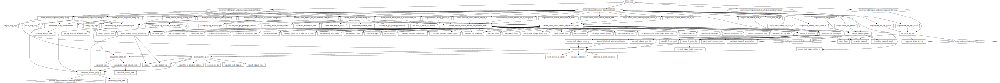

# Azure Virtual Machines Scale Sets Terraform Module

Azure virtual machine scale sets let you create and manage a group of identical, load balanced VMs. The number of VM instances can automatically increase or decrease in response to demand or a defined schedule. Scale sets provide high availability to your applications, and allow you to centrally manage, configure, and update a large number of VMs.

This module deploys Windows or Linux virtual machine scale sets with Public / Private Load Balancer support and many other features.

## Resources Supported

* [Linux Virtual Machine Scale Set](https://www.terraform.io/docs/providers/azurerm/r/linux_virtual_machine_scale_set.html)
* [Windows Virtual Machine Scale Set](https://www.terraform.io/docs/providers/azurerm/r/windows_virtual_machine_scale_set.html)
* [Automatic OS image upgrade](https://docs.microsoft.com/en-us/azure/virtual-machine-scale-sets/virtual-machine-scale-sets-automatic-upgrade)
* [Public Azure Load Balancer](https://www.terraform.io/docs/providers/azurerm/r/lb.html)
* [Private Azure Load Balancer](https://www.terraform.io/docs/providers/azurerm/r/lb.html)
* [Inbound NAT Rule](https://www.terraform.io/docs/providers/azurerm/r/lb_nat_pool.html)
* [Network Security Group](https://www.terraform.io/docs/providers/azurerm/r/network_security_group.html)
* [Log Analytics Agent Extension](https://docs.microsoft.com/en-us/azure/virtual-machines/extensions/oms-windows)
* [Azure Monitoring Diagnostics](https://www.terraform.io/docs/providers/azurerm/r/monitor_diagnostic_setting.html)

## Module Usage

```terraform
# Azurerm provider configuration
provider "azurerm" {
  features {}
}

data "azurerm_log_analytics_workspace" "example" {
  name                = "loganalytics-we-sharedtest2"
  resource_group_name = "rg-shared-westeurope-01"
}

module "vmscaleset" {
  source  = "kumarvna/vm-scale-sets/azurerm"
  version = "2.3.0"

  # Resource Group and location, VNet and Subnet detials (Required)
  resource_group_name  = "rg-shared-westeurope-01"
  virtual_network_name = "vnet-shared-hub-westeurope-001"
  subnet_name          = "snet-management"
  vmscaleset_name      = "testvmss"

  # This module support multiple Pre-Defined Linux and Windows Distributions.
  # Check the README.md file for more pre-defined images for Ubuntu, Centos, RedHat.
  # Please make sure to use gen2 images supported VM sizes if you use gen2 distributions
  # Specify `disable_password_authentication = false` to create random admin password
  # Specify a valid password with `admin_password` argument to use your own password 
  # To generate SSH key pair, specify `generate_admin_ssh_key = true`
  # To use existing key pair, specify `admin_ssh_key_data` to a valid SSH public key path.  
  os_flavor               = "linux"
  linux_distribution_name = "ubuntu1804"
  virtual_machine_size    = "Standard_A2_v2"
  admin_username          = "azureadmin"
  generate_admin_ssh_key  = true
  instances_count         = 2

  # Proxymity placement group, Automatic Instance repair and adding Public IP to VM's are optional.
  # remove these argument from module if you dont want to use it.  
  enable_proximity_placement_group    = true
  assign_public_ip_to_each_vm_in_vmss = true
  enable_automatic_instance_repair    = true

  # Public and private load balancer support for VM scale sets
  # Specify health probe port to allow LB to detect the backend endpoint status
  # Standard Load Balancer helps load-balance TCP and UDP flows on all ports simultaneously
  # Specify the list of ports based on your requirement for Load balanced ports
  # for additional data disks, provide the list for required size for the disk. 
  load_balancer_type              = "public"
  load_balancer_health_probe_port = 80
  load_balanced_port_list         = [80, 443]
  additional_data_disks           = [100, 200]

  # Enable Auto scaling feature for VM scaleset by set argument to true. 
  # Instances_count in VMSS will become default and minimum instance count.
  # Automatically scale out the number of VM instances based on CPU Average only.    
  enable_autoscale_for_vmss          = true
  minimum_instances_count            = 2
  maximum_instances_count            = 5
  scale_out_cpu_percentage_threshold = 80
  scale_in_cpu_percentage_threshold  = 20

  # Boot diagnostics to troubleshoot virtual machines, by default uses managed 
  # To use custom storage account, specify `storage_account_name` with a valid name
  # Passing a `null` value will utilize a Managed Storage Account to store Boot Diagnostics
  enable_boot_diagnostics = true

  # Network Seurity group port allow definitions for each Virtual Machine
  # NSG association to be added automatically for all network interfaces.
  # Remove this NSG rules block, if `existing_network_security_group_id` is specified
  nsg_inbound_rules = [
    {
      name                   = "http"
      destination_port_range = "80"
      source_address_prefix  = "*"
    },

    {
      name                   = "https"
      destination_port_range = "443"
      source_address_prefix  = "*"
    },
  ]

  # (Optional) To enable Azure Monitoring and install log analytics agents
  # (Optional) Specify `storage_account_name` to save monitoring logs to storage.   
  log_analytics_workspace_id = data.azurerm_log_analytics_workspace.example.id

  # Deploy log analytics agents to virtual machine. 
  # Log analytics workspace customer id and primary shared key required.
  deploy_log_analytics_agent                 = true
  log_analytics_customer_id                  = data.azurerm_log_analytics_workspace.example.workspace_id
  log_analytics_workspace_primary_shared_key = data.azurerm_log_analytics_workspace.example.primary_shared_key

  # Adding additional TAG's to your Azure resources
  tags = {
    ProjectName  = "demo-project"
    Env          = "dev"
    Owner        = "user@example.com"
    BusinessUnit = "CORP"
    ServiceClass = "Gold"
  }
}
```

## Default Local Administrator and the Password

This module utilizes __`azureadmin`__ as a local administrator on virtual machines. If you want to you use custom username, then specify the same by setting up the argument `admin_username` with valid user string.

By default, this module generates a strong password for all virtual machines also allows you to change the length of the random password (currently 24) using the `random_password_length = 32` variable. If you want to set the custom password, specify the argument `admin_password` with a valid string.

This module also generates SSH2 Key pair for Linux servers by default, however, it is only recommended to use for dev environment. For production environments, please generate your own SSH2 key with a passphrase and input the key by providing the path to the argument `admin_ssh_key_data`.

## Pre-Defined Windows and Linux VM Images

Automatic OS image upgrades are enabled on this module, so it helps update management by safely and automatically upgrading the OS disk for all instances in the scale set. Once configured, the latest OS image published by image publishers is automatically applied to the scale set without user intervention. Upgrades batches of instances in a rolling manner each time a new image is published by the publisher.

Only certain OS platform images are currently supported. Following pre-defined Windows or Linux images are available with the automatic upgrade option. To deploy these images specify `linux_distribution_name` or `windows_distribution_name` argument with following distributions.

OS type |Available Pre-defined Images|
--------|----------------------------|
Linux |`ubuntu1804`, `ubuntu1604`, `centos75`, `coreos`
Windows|`windows2012r2dc`, `windows2016dc`, `windows2019dc`, `windows2016dccore`

## Custom Virtual Machine images

If the pre-defined Windows or Linux variants are not sufficient then, you can specify the custom image by setting up the argument `custom_image` with appropriate values. Custom images can be used to bootstrap configurations such as preloading applications, application configurations, and other OS configurations. For more information [check here](https://docs.microsoft.com/en-us/azure/virtual-machines/linux/tutorial-custom-images)

```hcl
module "vmscaleset" {
  source  = "kumarvna/vm-scale-sets/azurerm"
  version = "2.3.0"

  # .... omitted

  os_flavor               = "linux"
  linux_distribution_name = "ubuntu1804"
  virtual_machine_size    = "Standard_A2_v2"
  admin_username          = "azureadmin"
  generate_admin_ssh_key  = true
  instances_count         = 2

  custom_image = {
      publisher = "myPublisher"
      offer     = "myOffer"
      sku       = "mySKU"
      version   = "latest"
    }

  # .... omitted

}
```

## Custom DNS servers

This is an optional feature and only applicable if you are using your own DNS servers superseding default DNS services provided by Azure. Set the argument `dns_servers = ["4.4.4.4"]` to enable this option. For multiple DNS servers, set the argument `dns_servers = ["4.4.4.4", "8.8.8.8"]`

## Advanced Usage of the Module

### `disable_password_authentication` - enable or disable VM password authentication

While creating the Linux servers, its recommended to use ssh2 keys to log in than using a password. By default, this module generates the ssh2 key pair for Linux VM's. If you want the password to login Linux VM, set the argument `disable_password_authentication = false`, this instructs the module to create a random password.

### `enable_ip_forwarding` - enable or disable IP forwarding

The setting must be enabled for every network interface that is attached to the virtual machine that receives traffic that the virtual machine needs to forward. A virtual machine can forward traffic whether it has multiple network interfaces or a single network interface attached to it. While IP forwarding is an Azure setting, the virtual machine must also run an application able to forward the traffic, such as firewall, WAN optimization, and load balancing applications. IP forwarding is typically used with user-defined routes.

By default, this not enabled and set to disable. To enable the IP forwarding using this module, set the argument `enable_ip_forwarding = true`.

### `enable_accelerated_networking` for Virtual Machines

Accelerated networking enables single root I/O virtualization (SR-IOV) to a VM, greatly improving its networking performance. This high-performance path bypasses the host from the data path, which reduces latency, jitter, and CPU utilization for the most demanding network workloads on supported VM types.

Accelerated Networking is supported on most general-purpose and compute-optimized instance sizes with two or more virtual CPUs (vCPUs). These supported series are Dv2/DSv2 and F/Fs.

On instances that support hyperthreading, accelerated networking is supported on VM instances with four or more vCPUs. Supported series are: D/Dsv3, D/Dsv4, E/Esv3, Ea/Easv4, Fsv2, Lsv2, Ms/Mms, and Ms/Mmsv2.

By default, this not enabled and set to disable. To enable the accelerated networking using this module, set the argument `enable_accelerated_networking = true`.

### `private_ip_address_allocation_type` - Static IP Assignment

The Internal Load Balancer Virtual IP is accessible within the entire virtual network as well as from on-premises and inter connected VNets through the secure IP Sec tunnel. By default, the Azure DHCP servers assign the private IPv4 address for the load balancer. You can specify static IP address for Internal load balancer. Unless necessary, you should never manually set the IP address.

By default this not enabled and set to be dynamic. To enable the static private IP using this module, set the argument `private_ip_address_allocation_type = "Static"` and set the argument `private_ip_address` with valid static private IP.

### `source_image_id` - Create a VM from a managed image

We can create multiple virtual machines from an Azure managed VM image. A managed VM image contains the information necessary to create a VM, including the OS and data disks. The virtual hard disks (VHDs) that make up the image, including both the OS disks and any data disks, are stored as managed disks. One managed image supports up to 20 simultaneous deployments.

When you use the managed VM image, custom image, or any other source image reference are not valid. By default, this not enabled and set to use predefined or custom images. To utilize Azure managed VM Image by this module, set the argument `source_image_id` with valid manage image resource id.

### `license_type` - Bring your own License to your Windows server

Azure Hybrid Benefit for Windows Server allows you to use your on-premises Windows Server licenses and run Windows virtual machines on Azure at a reduced cost. You can use Azure Hybrid Benefit for Windows Server to deploy new virtual machines with Windows OS.

By default, this is set to `None`. To use the Azure Hybrid Benefit for windows server deployment by this module, set the argument `license_type` to valid values. Possible values are `None`, `Windows_Client` and `Windows_Server`.

### `os_disk_storage_account_type` - OS disk for VM Instances

Azure managed disks are block-level storage volumes that are managed by Azure and used with Azure Virtual Machines. Managed disks are like a physical disk in an on-premises server but virtualized. With managed disks, all you have to do is specify the disk size, the disk type, and provision the disk. Once you provision the disk, Azure handles the rest. The available types of disks are ultra disks, premium solid-state drives (SSD), standard SSDs, and standard hard disk drives (HDD).

By default, this module uses the standard SSD with Locally redundant storage (`StandardSSD_LRS`). To use other type of disks, set the argument `os_disk_storage_account_type` with valid values. Possible values are `Standard_LRS`, `StandardSSD_LRS` and `Premium_LRS`.

### `additional_data_disks_storage_account_type` - Data disk support to VM Instances

Azure virtual machine scale sets support VM instances with attached data disks. You can attach data disks when the scale set is created, or to an existing scale set.

By default, this module uses the standard Locally redundant storage (`Standard_LRS`). To use other type of disks, set the argument `additional_data_disks_storage_account_type` with valid values. Possible values are `Standard_LRS`, `StandardSSD_LRS` and `Premium_LRS`.

This module also supports attaching data disks by setting up the argument `additional_data_disks = [100, 300]` with valid disk size in GB.

> Note: When you create a scale set with attached data disks, you need to mount and format the disks from within a VM to use them (just like for standalone Azure VMs). A convenient way to complete this process is to use a Custom Script Extension that calls a script to partition and format all the data disks on a VM.

### `single_placement_group` - large scale sets

By default, a scale set consists of a single placement group with a maximum size of 100 VMs. If a scale set property called singlePlacementGroup is set to false, the scale set can be composed of multiple placement groups and has a range of 0-1,000 VMs.

By default this is enabled and set to `true`. To change this value to allow multiple placement groups set the argument `single_placement_group = false`

### `assign_public_ip_to_each_vm_in_vmss` - Public IP per Virtual Machine

In general, Azure scale set virtual machines do not require their own public IP addresses. For most scenarios, it is more economical and secure to associate a public IP address to a load balancer or to a Bastion server, which then routes incoming connections to scale set virtual machines as needed.

However, some scenarios do require scale set virtual machines to have their own public IP addresses. An example is where virtual machines need to make external connections to one another across regions in a distributed database.

To create a scale set that assigns a public IP address to each virtual machine, set the argument `assign_public_ip_to_each_vm_in_vmss = true`

### `enable_automatic_instance_repair` - Automatically repair unhealthy Instances

Enabling automatic instance repairs for Azure virtual machine scale sets helps achieve high availability for applications by maintaining a set of healthy instances. If an instance in the scale set is found to be unhealthy as reported by Application Health extension or Load balancer health probes, then this feature automatically performs instance repair by deleting the unhealthy instance and creating a new one to replace it.

When an instance goes through a state change operation because of a PUT, PATCH or POST action performed on the scale set (for example reimage, redeploy, update, etc.), then any repair action on that instance is performed only after waiting for the grace period. Grace period is the amount of time to allow the instance to return to healthy state. Grace period is specified in minutes in ISO 8601 format and has a default value of 30 minutes.

The automatic instance repair feature can be enabled while creating a new scale set by setting up the argument `enable_automatic_instance_repair = true` and the grace period can be managed using the argument `grace_period = "PT30M"`. Default grace period is 30 minutes.

### `enable_proximity_placement_group` -  Achieving the lowest possible latency

Placing VMs in a single region reduces the physical distance between the instances. Placing them within a single availability zone will also bring them physically closer together. However, as the Azure footprint grows, a single availability zone may span multiple physical data centers, which may result in a network latency impacting your application.

To get VMs as close as possible, achieving the lowest possible latency, you should deploy them within a proximity placement group.

A proximity placement group is a logical grouping used to make sure that Azure compute resources are physically located close to each other. Proximity placement groups are useful for workloads where low latency is a requirement.

By default, this not enabled and set to disable. To enable the Proximity placement group with this module, set the argument `enable_proximity_placement_group = true`.

### `Identity` - Configure managed identities for Azure resources on a VM Scale Sets

Managed identities for Azure resources provides Azure services with an automatically managed identity in Azure Active Directory. You can use this identity to authenticate to any service that supports Azure AD authentication, without having credentials in your code.

There are two types of managed identities:

* **System-assigned**: When enabled a system-assigned managed identity an identity is created in Azure AD that is tied to the lifecycle of that service instance. when the resource is deleted, Azure automatically deletes the identity. By design, only that Azure resource can use this identity to request tokens from Azure AD.
* **User-assigned**: A managed identity as a standalone Azure resource. For User-assigned managed identities, the identity is managed separately from the resources that use it.

Regardless of the type of identity chosen a managed identity is a service principal of a special type that may only be used with Azure resources. When the managed identity is deleted, the corresponding service principal is automatically removed.

```terraform
resource "azurerm_user_assigned_identity" "example" {
  for_each            = toset(["user-identity1", "user-identity2"])
  resource_group_name = "rg-shared-westeurope-01"
  location            = "westeurope"
  name                = each.key
}

module "vmscaleset" {
  source  = "kumarvna/vm-scale-sets/azurerm"
  version = "2.3.0"

  # .... omitted for bravity
  
  os_flavor               = "linux"
  linux_distribution_name = "ubuntu1804"
  virtual_machine_size    = "Standard_A2_v2"
  admin_username          = "azureadmin"
  generate_admin_ssh_key  = true
  instances_count         = 2

  # Configure managed identities for Azure resources on a VM
  # Possible types are `SystemAssigned`, `UserAssigned` and `SystemAssigned, UserAssigned`.
  managed_identity_type = "UserAssigned"
  managed_identity_ids  = [for k in azurerm_user_assigned_identity.example : k.id]

# .... omitted for bravity

}
```

### `enable_boot_diagnostics` - boot diagnostics to troubleshoot virtual machines

Boot diagnostics is a debugging feature for Azure virtual machines (VM) that allows the diagnosis of VM boot failures. Boot diagnostics enables a user to observe the state of their VM as it is booting up by collecting serial log information and screenshots. This module enabled this feature by setting up `enable_boot_diagnostics = true`. Azure Storage Account to be used to store Boot Diagnostics, including Console Output and Screenshots from the Hypervisor. This module supports the existing storage account using the `storage_account_name` argument with a valid name. If we are not passing any storage account, it will utilize a Managed Storage Account to store Boot Diagnostics.

### `winrm_protocol` - Enable WinRM wiht HTTPS

Window remote management - in short, `WinRM` is a built-in windows protocol/Service which uses soap[simple object access protocol] to connect from another source system. Using WinRM, we can connect the remote system and execute any command there as its native user.

WinRM comes pre-installed with all new window OS. We need to enable WinRM service and configure the ports for outside traffic. This module configure `winRM` by setting up `winrm_protocol = "Https"` and `key_vault_certificate_secret_url` value to the Secret URL of a Key Vault Certificate.

## Network Security Groups

By default, the network security groups connected to Network Interface and allow necessary traffic and block everything else (deny-all rule). Use `nsg_inbound_rules` in this Terraform module to create a Network Security Group (NSG) for network interface and allow it to add additional rules for inbound flows.

In the Source and Destination columns, `VirtualNetwork`, `AzureLoadBalancer`, and `Internet` are service tags, rather than IP addresses. In the protocol column, Any encompasses `TCP`, `UDP`, and `ICMP`. When creating a rule, you can specify `TCP`, `UDP`, `ICMP` or `*`. `0.0.0.0/0` in the Source and Destination columns represents all addresses.

*You cannot remove the default rules, but you can override them by creating rules with higher priorities.*

```hcl
module "vmscaleset" {
  source  = "kumarvna/vm-scale-sets/azurerm"
  version = "2.3.0"

  # .... omitted for bravity
  
  os_flavor               = "linux"
  linux_distribution_name = "ubuntu1804"
  virtual_machine_size    = "Standard_A2_v2"
  admin_username          = "azureadmin"
  generate_admin_ssh_key  = true
  instances_count         = 2

  nsg_inbound_rules = [
    {
      name                   = "ssh"
      destination_port_range = "80"
      source_address_prefix  = "*"
    },

    {
      name                   = "http"
      destination_port_range = "443"
      source_address_prefix  = "*"
    },
  ]
}
```

## Using exisging Network Security Groups

Enterprise environments may need a requirement to use pre-existing NSG groups to maintain capabilities. This module supports existing network security groups usage. To use this feature, set the argument `existing_network_security_group_id` with a valid NSG resource id and remove all NSG inbound rules blocks from the module.

```terraform
data "azurerm_network_security_group" "example" {
  name                = "nsg_mgnt_subnet_in"
  resource_group_name = "vnet-shared-hub-westeurope-001"
}

module "vmscaleset" {
  source  = "kumarvna/vm-scale-sets/azurerm"
  version = "2.3.0"

  # .... omitted for bravity
  
  os_flavor               = "linux"
  linux_distribution_name = "ubuntu1804"
  virtual_machine_size    = "Standard_A2_v2"
  admin_username          = "azureadmin"
  generate_admin_ssh_key  = true
  instances_count         = 2

  # Network Seurity group port allow definitions for each Virtual Machine
  # NSG association to be added automatically for all network interfaces.
  # Remove this NSG rules block, if `existing_network_security_group_id` is specified
  existing_network_security_group_id = data.azurerm_network_security_group.example.id

  # .... omitted for bravity

}
```

## Recommended naming and tagging conventions

Applying tags to your Azure resources, resource groups, and subscriptions to logically organize them into a taxonomy. Each tag consists of a name and a value pair. For example, you can apply the name `Environment` and the value `Production` to all the resources in production.
For recommendations on how to implement a tagging strategy, see Resource naming and tagging decision guide.

>**Important** :
Tag names are case-insensitive for operations. A tag with a tag name, regardless of the casing, is updated or retrieved. However, the resource provider might keep the casing you provide for the tag name. You'll see that casing in cost reports. **Tag values are case-sensitive.**

An effective naming convention assembles resource names by using important resource information as parts of a resource's name. For example, using these [recommended naming conventions](https://docs.microsoft.com/en-us/azure/cloud-adoption-framework/ready/azure-best-practices/naming-and-tagging#example-names), a public IP resource for a production SharePoint workload is named like this: `pip-sharepoint-prod-westus-001`.

## Requirements

Name | Version
-----|--------
terraform | >= 0.13
azurerm | >= 2.59.0

## Providers

| Name | Version |
|------|---------|
| azurerm | >= 2.59.0 |
| random | >= 3.1.0 |
| tls | >= 3.1.0 |

## Inputs

Name | Description | Type | Default
---- | ----------- | ---- | -------
`resource_group_name` | The name of the resource group in which resources are created | string | `""`
`virtual_network_name`|The name of the virtual network|string |`""`
`subnet_name`|The name of the subnet to use in VM scale set|string |`""`
`storage_account_name`|The name of the hub storage account to store logs|string | `""`
`random_password_length`|The desired length of random password created by this module|number|`24`
`public_ip_allocation_method`|Defines the allocation method for this IP address. Possible values are `Static` or `Dynamic`|string|`Static`
`public_ip_sku`|The SKU of the Public IP. Accepted values are `Basic` and `Standard`|string|`Standard`
`domain_name_label`|Label for the Domain Name. Will be used to make up the FQDN. If a domain name label is specified, an A DNS record is created for the public IP in the Microsoft Azure DNS system|string|`null`
`public_ip_sku_tier`|The SKU Tier that should be used for the Public IP. Possible values are `Regional` and `Global`|string|`"Regional"`
`enable_load_balancer`|Controls if public load balancer should be created|sting|`true`
`load_balancer_type`|Controls the type of load balancer should be created. Possible values are `public` and `private`|string | `"private"`
`load_balancer_sku`|The SKU of the Azure Load Balancer. Accepted values are `Basic` and `Standard`|string | `"Standard"`
`private_ip_address_allocation_type`|The allocation method used for the Private IP Address. Possible values are `Dynamic` and `Static`.|string|`Dynamic`
`lb_private_ip_address`|The Static Private IP Address to assign to the Load Balancer. This is valid only when `private_ip_address_allocation_type` is set to `Static` only|string|`null`
`lb_probe_protocol`|Specifies the protocol of the end point. Possible values are `Http`, `Https` or `Tcp`. If `Tcp` is specified, a received ACK is required for the probe to be successful. If `Http` is specified, a `200 OK` response from the specified `URI` is required for the probe to be successful|string|`null`
`lb_probe_request_path`|The URI used for requesting health status from the backend endpoint. Required if protocol is set to `Http` or `Https`. Otherwise, it is not allowed|string|`null`
`number_of_probes`|The number of failed probe attempts after which the backend endpoint is removed from rotation. The default value is `2`. `NumberOfProbes` multiplied by `intervalInSeconds` value must be greater or equal to 10.Endpoints are returned to rotation when at least one probe is successful|number|`null`
`enable_lb_nat_pool`|If enabled load balancer NAT pool will be created for SSH if flavor is Linux and for RDP if flavor is windows|string|`false`
`nat_pool_frontend_ports`|Optional override for default NAT ports|list(number)|`[50000, 50119]`
`load_balancer_health_probe_port`|Port on which the Probe queries the backend endpoint. Default `80`|number|`80`
`load_balanced_port_list`|List of ports to be forwarded through the load balancer to the VMs|list|`[]`
`enable_proximity_placement_group`|Manages a proximity placement group for virtual machines, virtual machine scale sets and availability sets|string|`false`
`existing_network_security_group_id`|The resource id of existing network security group|string|`null`
`nsg_inbound_rules`|List of network rules to apply to network interface|object|`{}`
`os_flavor`|Specify the flavor of the operating system image to deploy Virtual Machine. Possible values are `windows` and `linux`|string |`"windows"`
`vmscaleset_name`|Specifies the name of the virtual machine scale set resource|string | `""`
`computer_name_prefix`|Specifies the name of the virtual machine inside the VM scale set|string|`null`
`virtual_machine_size`|The Virtual Machine SKU for the Virtual Machine|string|`"Standard_A2_v2"`
`instances_count`|The number of Virtual Machines required|number|`2`
`admin_username`|The username of the local administrator used for the Virtual Machine|string|`"azureadmin"`
`admin_password`|The Password which should be used for the local-administrator on the Virtual Machines|string|`null`
`custom_data`|Base64 encoded file of a bash script that gets run once by cloud-init upon VM scale set creation|string|`null`
`disable_password_authentication`|Should Password Authentication be disabled on this Virtual Machine scale sets?|string|`true`
`overprovision`|Should Azure over-provision Virtual Machines in this Scale Set? This means that multiple Virtual Machines will be provisioned and Azure will keep the instances which become available first - which improves provisioning success rates and improves deployment time. You're not billed for these over-provisioned VM's and they don't count towards the Subscription Quota. Defaults to true|string|`false`
`do_not_run_extensions_on_overprovisioned_machines`|Should Virtual Machine Extensions be run on Overprovisioned Virtual Machines in the Scale Set?|string|`false`
`enable_windows_vm_automatic_updates`|Are automatic updates enabled for Windows Virtual Machine in this scale set? Module keep this as `false` if `os_upgrade_mode = "Automatic"` specified.|string|`true`
`enable_encryption_at_host`|Should all of the disks (including the temp disk) attached to this Virtual Machine be encrypted by enabling Encryption at Host?|string|`false`
`license_type`|Specifies the type of on-premise license which should be used for this Virtual Machine. Possible values are `None`, `Windows_Client` and `Windows_Server`.|string|`"None"`
`platform_fault_domain_count`|Specifies the number of fault domains that are used by this Linux Virtual Machine Scale Set|number|`null`
`scale_in_policy`|The scale-in policy rule that decides which virtual machines are chosen for removal when a Virtual Machine Scale Set is scaled in. Possible values for the scale-in policy rules are `Default`, `NewestVM` and `OldestVM`|string|`"Default"`
`single_placement_group`|Allow to have cluster of 100 VMs only per VM scale set|string|`true`
`source_image_id`|The ID of an Image which each Virtual Machine should be based on|string|`null`
`os_upgrade_mode`|Specifies how Upgrades (e.g. changing the Image/SKU) should be performed to Virtual Machine Instances. Possible values are `Automatic`, `Manual` and `Rolling`.|string|`Automatic`
`vm_time_zone`|Specifies the Time Zone which should be used by the Virtual Machine. Ex. `"UTC"` or `"W. Europe Standard Time"` [The possible values are defined here](https://jackstromberg.com/2017/01/list-of-time-zones-consumed-by-azure/) |string|`null`
`availability_zones`|A list of Availability Zones in which the Virtual Machines in this Scale Set should be created in|list(number)|`null`
`availability_zone_balance`|Should the Virtual Machines in this Scale Set be strictly evenly distributed across Availability Zones?|string|`false`
`generate_admin_ssh_key`|Generates a secure private key and encodes it as PEM|string|`false`
`admin_ssh_key_data`|specify the path to the existing SSH key to authenticate Linux virtual machine|string|`null`
`custom_image`|Provide the custom image to this module if the default variants are not sufficient|map(object)|`null`
`linux_distribution_list`|Pre-defined Azure Linux VM images list|map(object)|`ubuntu1804`
`linux_distribution_name`|Variable to pick an OS flavor for Linux based Virtual Machine. Possible values are `centos75`, `ubuntu1804`, `ubuntu1604`, `coreos`|string|`ubuntu1804`
`windows_distribution_list`|Pre-defined Azure Windows VM images list|map(object)|`"windows2019dc"`
`windows_distribution_name`|Variable to pick an OS flavor for Windows based VM. Possible values are `windows2012r2dc`, `windows2016dc`, `windows2019dc`, `windows2016dccore`|string|`"windows2019dc"`
`os_disk_storage_account_type`|The Type of Storage Account for Internal OS Disk. Possible values include Standard_LRS, StandardSSD_LRS and Premium_LRS.|string|`"StandardSSD_LRS"`
`os_disk_caching`|The Type of Caching which should be used for the Internal OS Disk. Possible values are `None`, `ReadOnly` and `ReadWrite`|string|`"ReadWrite"`
`disk_encryption_set_id`|The ID of the Disk Encryption Set which should be used to Encrypt this OS Disk. The Disk Encryption Set must have the `Reader` Role Assignment scoped on the Key Vault - in addition to an Access Policy to the Key Vault|string|`null`
`disk_size_gb`|The Size of the Internal OS Disk in GB, if you wish to vary from the size used in the image this Virtual Machine is sourced from|number|`null`
`enable_os_disk_write_accelerator`|Should Write Accelerator be Enabled for this OS Disk? This requires that the `storage_account_type` is set to `Premium_LRS` and that `caching` is set to `None`|string|`false`
`enable_ultra_ssd_data_disk_storage_support`|Should the capacity to enable Data Disks of the UltraSSD_LRS storage account type be supported on this Virtual Machine|string|`false`
`additional_data_disks`|Adding additional disks capacity to add each instance (GB)|list(number)|`[]`
`additional_data_disks_storage_account_type`|The Type of Storage Account which should back this Data Disk. Possible values include Standard_LRS, StandardSSD_LRS, Premium_LRS and UltraSSD_LRS.|string|`"Standard_LRS"`
`dns_servers`|List of dns servers to use for network interface|string|`[]`
`enable_ip_forwarding`|Should IP Forwarding be enabled?|string|`false`
`enable_accelerated_networking`|Should Accelerated Networking be enabled?|string|`false`
`assign_public_ip_to_each_vm_in_vmss`|Create a virtual machine scale set that assigns a public IP address to each VM|string|`false`
`public_ip_prefix_id`|The ID of the Public IP Address Prefix from where Public IP Addresses should be allocated|string|`null`
`rolling_upgrade_policy`|Enabling automatic OS image upgrades on your scale set helps ease update management by safely and automatically upgrading the OS disk for all instances in the scale set|object|`{}`
`enable_automatic_instance_repair`|Should the automatic instance repair be enabled on this Virtual Machine Scale Set?|string|`false`
`grace_period`|Amount of time (in minutes, between 30 and 90, defaults to 30 minutes) for which automatic repairs will be delayed.|string|`"PT30M"`
`managed_identity_type`|The type of Managed Identity which should be assigned to the Linux Virtual Machine Scale Set. Possible values are `SystemAssigned`, `UserAssigned` and `SystemAssigned, UserAssigned`|string|`null`
`managed_identity_ids`|A list of User Managed Identity ID's which should be assigned to the Linux Virtual Machine Scale Set.|string|`null`
`winrm_protocol`|Specifies the protocol of winrm listener. Possible values are `Http` or `Https`|string|`null`
`key_vault_certificate_secret_url`|The Secret URL of a Key Vault Certificate, which must be specified when `protocol` is set to `Https`|string|`null`
`additional_unattend_content`|The XML formatted content that is added to the unattend.xml file for the specified path and component|string|`null`
`additional_unattend_content_setting`|The name of the setting to which the content applies. Possible values are `AutoLogon` and `FirstLogonCommands`|string|`null`
`enable_boot_diagnostics`|Should the boot diagnostics enabled?|string|`false`
`storage_account_uri`|The Primary/Secondary Endpoint for the Azure Storage Account which should be used to store Boot Diagnostics, including Console Output and Screenshots from the Hypervisor. Passing a `null` value will utilize a Managed Storage Account to store Boot Diagnostics|string|`null`
`enable_autoscale_for_vmss`|Manages a AutoScale Setting which can be applied to Virtual Machine Scale Sets|string|`false`
`minimum_instances_count`|The minimum number of instances for this resource. Valid values are between 0 and 1000|string|`null`
`maximum_instances_count`|The maximum number of instances for this resource. Valid values are between 0 and 1000|string|`""`
`scale_out_cpu_percentage_threshold`|Specifies the threshold % of the metric that triggers the scale out action.|number|`80`
`scale_in_cpu_percentage_threshold`|Specifies the threshold % of the metric that triggers the scale in action.|number|`20`
`scaling_action_instances_number`|The number of instances involved in the scaling action|number|`1`
`deploy_log_analytics_agent`|Install log analytics agent to windows or linux VM scaleset instances|string|`false`
`log_analytics_workspace_id`|The name of log analytics workspace resource id|string|`null`
`log_analytics_customer_id`|The Workspace (or Customer) ID for the Log Analytics Workspace|string|`null`
`log_analytics_workspace_primary_shared_key`|The Primary shared key for the Log Analytics Workspace|string|`null`
`intall_iis_server_on_instances`|Install ISS server on every Instance in the VM scale set|string|`false`
`Tags`|A map of tags to add to all resources|map|`{}`

## Outputs

|Name | Description|
|---- | -----------|
`admin_ssh_key_public`|The generated public key data in PEM format
`admin_ssh_key_private`|The generated private key data in PEM format
`windows_vm_password`|Password for the windows Virtual Machine
`linux_vm_password`|Password for the Linux Virtual Machine
`load_balancer_public_ip`|The Public IP address allocated for load balancer
`load_balancer_private_ip`|The Private IP address allocated for load balancer
`load_balancer_nat_pool_id`|The resource ID of the Load Balancer NAT pool
`load_balancer_health_probe_id`|The resource ID of the Load Balancer health Probe
`load_balancer_rules_id`|The resource ID of the Load Balancer Rule
`network_security_group_id`|The resource id of Network security group
`linux_virtual_machine_scale_set_name`|The name of the Linux Virtual Machine Scale Set
`linux_virtual_machine_scale_set_id`|The resource ID of the Linux Virtual Machine Scale Set
`linux_virtual_machine_scale_set_unique_id`|The unique ID of the Linux Virtual Machine Scale Set
`windows_virtual_machine_scale_set_name`|The name of the windows Virtual Machine Scale Set
`windows_virtual_machine_scale_set_id`|The resource ID of the windows Virtual Machine Scale Set
`windows_virtual_machine_scale_set_unique_id`|The unique ID of the windows Virtual Machine Scale Set

## Resource Graph



## Authors

Originally created by [Kumaraswamy Vithanala](mailto:kumarvna@gmail.com)

## Other resources

* [Virtual Machine Scale Sets](https://docs.microsoft.com/en-us/azure/virtual-machine-scale-sets/)
* [Terraform AzureRM Provider Documentation](https://www.terraform.io/docs/providers/azurerm/index.html)
